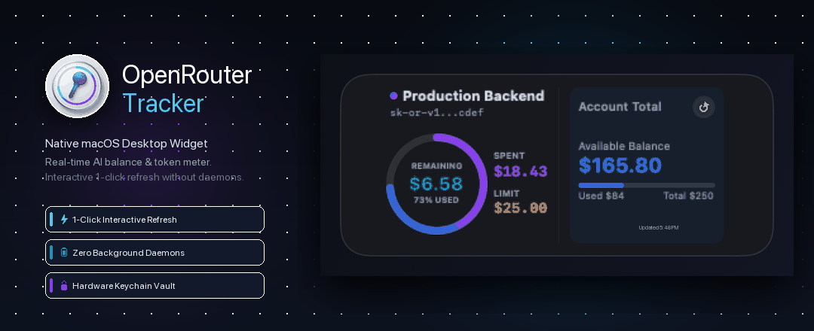
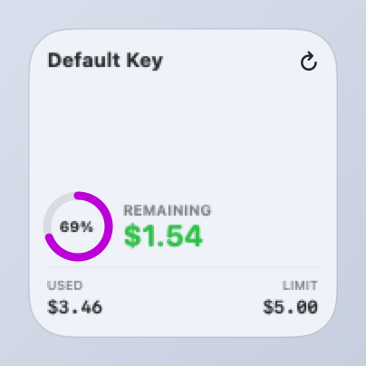
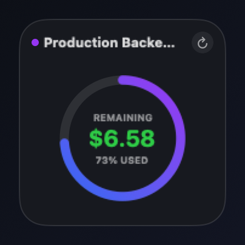
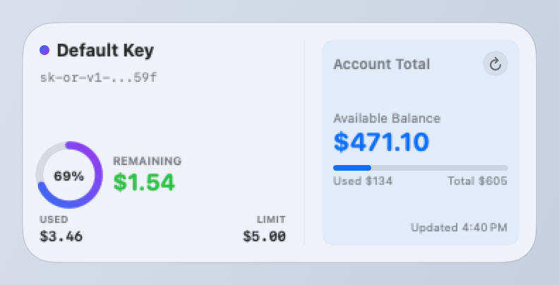
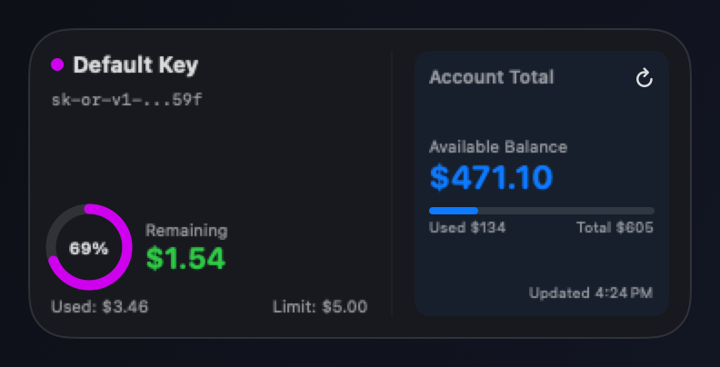
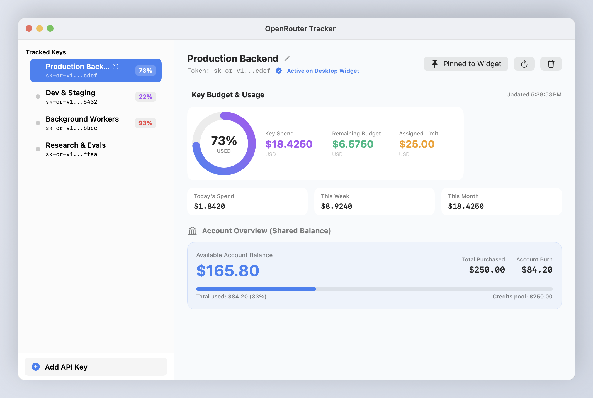
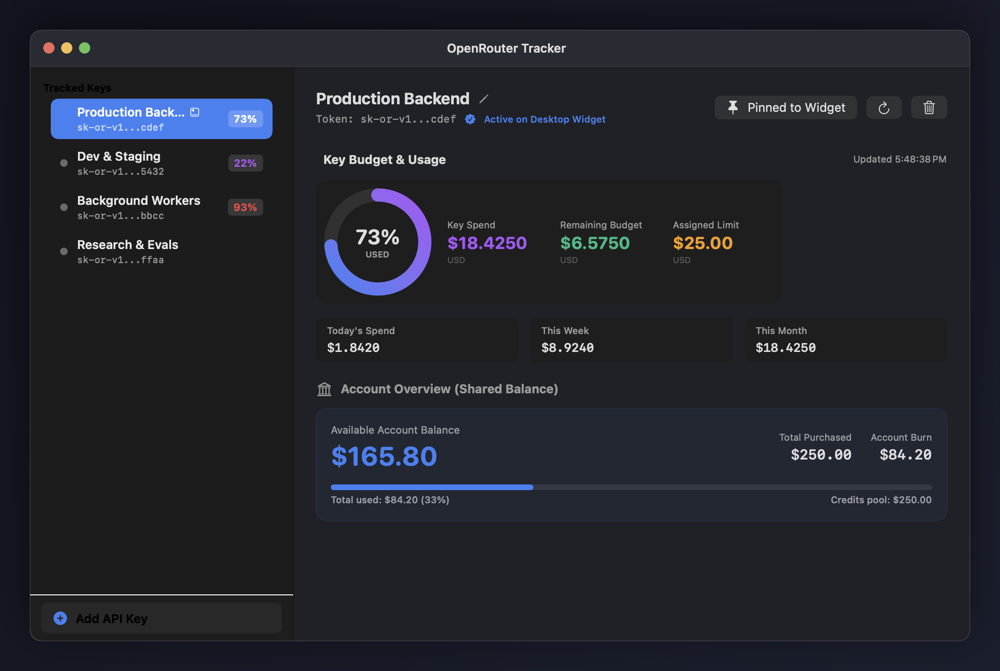

<p align="center">
  
</p>

# OpenRouter Tracker

[](https://apple.com/macos)
[](#windows-method)
[](https://swift.org)
[](https://developer.apple.com/xcode/swiftui/)
[](#zero-background-resource-usage)
[](PRIVACY_POLICY.md)
[](LICENSE)
[](https://github.com/vyavahareyash/openrouter-tracker/releases/latest)

OpenRouter Tracker is a native macOS desktop widget and companion app designed for developers, engineering teams, and autonomous AI agents. It gives you instant glanceability over your OpenRouter credit balances, usage pacing, and rate limits directly on your desktop—with **zero background battery drain** and an **interactive 1-click refresh button**.

---

## The "Blind Key" Problem

Developers frequently work with organization-provisioned OpenRouter API keys or separate project tokens without direct access to the web dashboard. You only discover a key has run out of credits when an active build pipeline, local coding agent, or evaluation run crashes mid-flight.

OpenRouter Tracker solves this by placing live, interactive balance gauges right on your macOS desktop:

```text
Glanceable Balance = Real-time Account Balance - Key Spend
```

- **Interactive 1-Click Refresh**: Tap the `🔄` button directly on the desktop widget to instantly query the latest balance in-place via Apple's native `AppIntents`.
- **Zero Background Resource Usage**: Runs **no** background scripts or daemon processes. Apple's system scheduler (`chronod`) manages timeline updates without battery overhead.
- **Hardware Keychain Encryption**: Keys are stored locally using Apple Keychain Services and shared across the sandboxed App Group container. Zero middleman servers or analytics.

---

## Downloads & Installation

> 🪟 **Windows or CLI-only users**: Don't want to install the macOS app? Jump directly to [Option 4: Windows & CLI Terminal Method](#windows-method).

### Option 1: Homebrew (Recommended)

```bash
# Install
brew tap vyavahareyash/tap
brew install --cask openrouter-tracker

# Update & upgrade to the latest release
brew update
brew upgrade --cask openrouter-tracker
```

### Option 2: Direct Download (DMG)
- 🍏 **macOS (Universal / Apple Silicon & Intel)**: [Download OpenRouterTracker.dmg](https://github.com/vyavahareyash/openrouter-tracker/releases/latest/download/OpenRouterTracker.dmg)
- 🪟 **Windows / Linux / Headless**: Jump to [Windows & CLI Method](#windows-method)

---

### 🛡️ First-Launch & macOS Security Prompts

#### 1. Gatekeeper ("App is damaged" or "Unidentified Developer")
Because this open-source release is ad-hoc signed rather than signed with a paid ($99/year) Apple Developer certificate, macOS Gatekeeper may intercept the first launch.

You only need to allow it **once**:
- **Quick Terminal Fix** (Recommended):
  ```bash
  xattr -cr /Applications/OpenRouterTracker.app
  ```
- **Or via Finder**: In `/Applications`, **Control-click (or Right-click)** `OpenRouterTracker.app` → select **Open** → click **Open** in the alert dialog.
- **Or via System Settings**: Go to **System Settings > Privacy & Security**, scroll down to the Security section, and click **Open Anyway**.

#### 2. macOS Keychain Access Prompt ("OpenRouter Tracker wants to use your login keychain")
When you save an API key, macOS prompts for your login password with:
> *"OpenRouter Tracker wants to use the 'login' keychain. Type the password for this user to allow this."*

- **Why this happens**: OpenRouter Tracker never stores your raw API keys in plain text files. Instead, it delegates security to **Apple's Hardware Keychain Services (`kSecClassGenericPassword`)** with AES-256 encryption. macOS confirms your Mac user password to grant access to the secure enclave item.
- **What to click**: Enter your Mac user password and click **"Always Allow"** so the companion app and the desktop widget can seamlessly access the key without re-prompting on every widget refresh.

### Option 3: Build From Source
```bash
# Clone the repository
git clone https://github.com/vyavahareyash/openrouter-tracker.git
cd openrouter-tracker

# Clean build and bundle the app & widget
./build.sh

# Launch the app
open build/OpenRouterTracker.app
```

<a id="windows-method"></a>
### Option 4: Legacy Terminal Script (Windows / Linux / CLI)
For users on Windows, Linux, or headless environments who do not want to install the macOS desktop application, use the legacy standalone terminal script:

```bash
# 1. (Optional) Configure .env from template
cp .env.example .env       # Windows: copy .env.example .env

# 2. Run script (reads .env, environment variable, or inline argument)
python3 scripts/check_usage.py [YOUR_KEY]
```
- **Zero Dependencies**: Uses standard Python 3 libraries (`urllib`, `json`), with auto-fallback to `requests` and `python-dotenv` if installed.
- **Cross-Platform**: Works identically on Windows (`python scripts\check_usage.py`), macOS, and Linux.
- **Template Included**: Root [`.env.example`](.env.example) is ready to copy into `.env`.

---

## Key Features

- ⚡ **1-Click Interactive Widget Refresh**: Powered by `AppIntents`. Click the refresh icon directly on the widget to update balances in < 500ms without opening the host application.
- 🔋 **Zero Battery Overhead**: Managed strictly by macOS `chronod`. No continuous daemon, timer loops, or menubar CPU hogs.
- 🖥️ **Multiple Widget Sizes**: Choose between `systemSmall` (compact balance beacon) and `systemMedium` (detailed credit limit burn bar and rate-limit counters).
- 🔑 **Multi-Key Management**: Add multiple project or client keys, label them with custom nicknames, and toggle which key appears on your desktop with one click.
- 🔐 **Defense-in-Depth Privacy**: Keys are encrypted via Apple Keychain (`kSecClassGenericPassword`) and cached in the sandboxed App Group container (`group.com.openrouter.tracker`).
- 📊 **Rate Limit Gauges**: View real-time requests-per-second and hourly rate limit allocations returned by OpenRouter's tier system.

---

## Visual Showcase

<table>
  <tr>
    <td align="center"><b>Small Widget (Light)</b></td>
    <td align="center"><b>Small Widget (Dark)</b></td>
  </tr>
  <tr>
    <td></td>
    <td></td>
  </tr>
  <tr>
    <td align="center"><b>Medium Widget (Light)</b></td>
    <td align="center"><b>Medium Widget (Dark)</b></td>
  </tr>
  <tr>
    <td></td>
    <td></td>
  </tr>
  <tr>
    <td align="center"><b>Companion App (Light)</b></td>
    <td align="center"><b>Companion App (Dark)</b></td>
  </tr>
  <tr>
    <td></td>
    <td></td>
  </tr>
</table>

> 📸 **Interactive Gallery**: View the full responsive screenshot comparison in the [Screenshot Gallery](screenshots/index.html).

---

## Adding the Widget to macOS Desktop

1. Open **OpenRouter Tracker** once and add your API key (`sk-or-v1-...`).
2. Right-click any open area on your macOS Desktop and select **"Edit Widgets..."**.
3. Search for **"OpenRouter"** in the widget gallery.
4. Drag either the **Small** or **Medium** widget onto your desktop or Notification Center.

---

## Documentation

Full architectural specifications, developer guides, and user manuals are organized in the [`docs/`](docs/INDEX.md) hub:

- [User Feature Guide](docs/user/FEATURE_GUIDE.md) — Walkthrough of all app capabilities, widget sizes, and multi-key workflows.
- [Onboarding & FAQ](docs/user/FAQ_AND_ONBOARDING.md) — 3-step setup guide, troubleshooting blank widgets, and FAQs.
- [Security & API Key Management](docs/user/SECURITY_AND_KEYS.md) — Keychain architecture, sandboxing, and token safety.
- [System Architecture](docs/engineering/ARCHITECTURE.md) — Module catalog, App Group IPC, AppIntents lifecycle, and Mermaid diagrams.
- [Calculations & Formulas](docs/engineering/CALCULATIONS.md) — Mathematical formulas for usage burn rate and depletion thresholds.
- [Developer Guide](docs/engineering/DEVELOPMENT.md) — CLI build scripts, testing with coverage, and packaging DMGs.
- [Product Specifications](docs/product/SPECIFICATION.md) — OpenRouter API schemas and offline resilience invariants.
- [Product Roadmap](docs/product/ROADMAP.md) — Upcoming features (Menu Bar status item, low balance alerts).
- [Architecture Decision Records (ADR)](docs/adr/) — Technical decisions behind App Group storage and AppIntents.

---

## Private by Default

OpenRouter Tracker makes **zero network calls** to any third-party analytics, tracking, or intermediary server. Outbound HTTPS traffic connects exclusively to official OpenRouter endpoints (`https://openrouter.ai/api/v1/*`). Review our formal [Privacy Policy](PRIVACY_POLICY.md).

---

## License

This project is licensed under the [MIT License](LICENSE).
