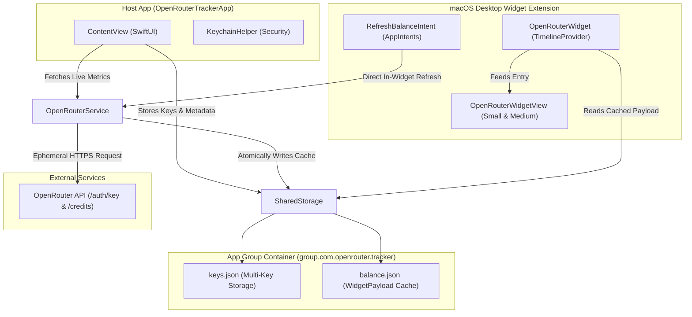

# System Architecture & Technical Specifications

This document defines the system architecture, inter-process communication (IPC) model, concurrency guarantees, and deep module boundaries of **OpenRouter Tracker**.

---

## 1. High-Level System Architecture

---

## 2. Core Modules & Seams

### `OpenRouterService` (Network & Parse Engine)
- **Role**: Coordinates concurrent asynchronous network requests to OpenRouter endpoints.
- **Methods**:
  - `fetchData(apiKey:customNickname:) async -> WidgetPayload`: Queries `/api/v1/auth/key` and `/api/v1/credits` via `async let`.
  - `refreshWidgetKey() async -> WidgetPayload`: Identifies the designated active desktop key from `SharedStorage`, performs network fetch, and saves new payload.
- **Safety**: Uses ephemeral `URLSessionConfiguration` to guarantee no authentication headers or keys are persisted in standard disk caches.

### `SharedStorage` (Cross-Process Storage)
- **Role**: Acts as the shared IPC layer between the un-sandboxed/sandboxed app and the widget extension.
- **Methods**:
  - `loadAllKeys() -> [TrackedKey]`
  - `saveKeys(_ keys: [TrackedKey])`
  - `getWidgetKey() -> TrackedKey?`
  - `setWidgetKey(id: UUID)`
  - `loadPayload() -> WidgetPayload?`
  - `savePayload(_ payload: WidgetPayload)`
- **Invariants**:
  - Write operations execute atomically to avoid partial JSON reads.
  - Exactly one tracked key possesses `isWidgetKey == true`.

### `RefreshBalanceIntent` (Interactive In-Widget Seam)
- **Role**: Conforms to Apple's `AppIntent` framework.
- **Execution Flow**:
  1. Triggered by user tapping the in-widget refresh button.
  2. Executes `OpenRouterService.refreshWidgetKey()` in a background worker context provided by macOS `chronod`.
  3. Signals `WidgetCenter.shared.reloadAllTimelines()`.
  4. Returns `.result()`, causing immediate view re-render without launching the companion app.
